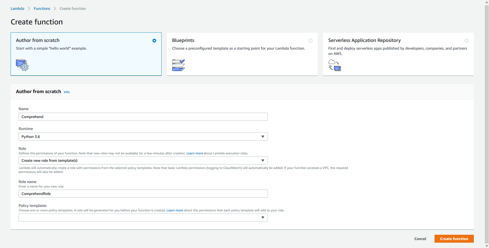

# Lambdas #

This repo contains two lambda functions: `comprehend` and `transcribe`, responsible for transcribing a audio file into text and comprehend the transcription. Both folder contains the lastest version deployed on the AWS platform and considering compatibility issues, all dependencies are downloaded into the folders. Simply create zip archives and upload to lambda platform.

## Requirements ##

1. AWS account :-)
2. Python 3.6

## Usage ##

- Simply create zip archives at the root of each directory.
- Upload the archives to the lambda platform.
- Choose `Python 3.6` when creating Lambda function.
- Create API Gateway endpoint for the created function.

## Update Dependencies ##

If the user intend to update some of the dependencies, we recommend that you do so under the lambda execution enviroment, which is available on AWS as an image able to be spinned up as an EC2 instance. Under the appropriate environment, update a specific dependency by running `pip install -t ./ PACKAGE` under the root of each lambda directory.

## Details ##

The lambdas are invoked when accessing certain API Gateway endpoints, and after the work is done, the results will be deserialized and POST to the backend server in JSON format for data persistence and visualizations. The two lambdas depends heavily on `boto3` and as it updates frequently, it is recommended that the user check the update first before implementing custom procedures to avoid potential problems of incompatibility.

## Credits ##

Built by: Dillon Stock, Cameron Korzecke

(README: Hansheng Zhao)

(C) 2018 Team Amazon

